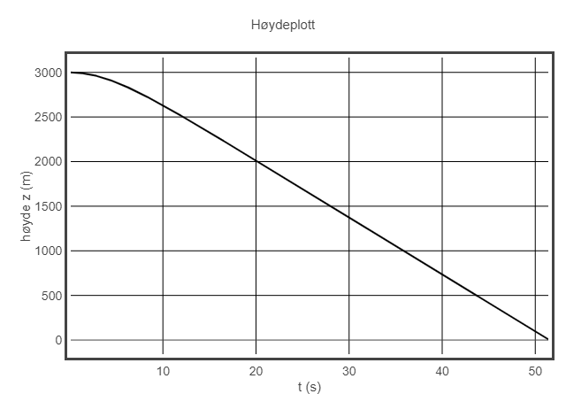
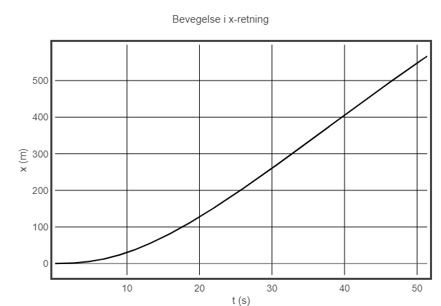

# week37

### Resultater fra fallskjermhopp med vind

### Resultater fra kollisjonsoppgavene
- Parametre: 
    - `m_tennisball = 0.05 kg`
    - `m_gokart = 50 kg`
    - `v_tennis = 20 m/s`
    - `v_gokart = -5.55 m/s`
- Antar at gokarten stopper når dens hastighet er mindre enn 0.05 m/s. Dette oppnås etter å ha kastet 122 tennisballer på gokarten.
- Dersom vi antar at ballene lander i gokarten etter støtet, trengs det 130 baller."# week37" 
